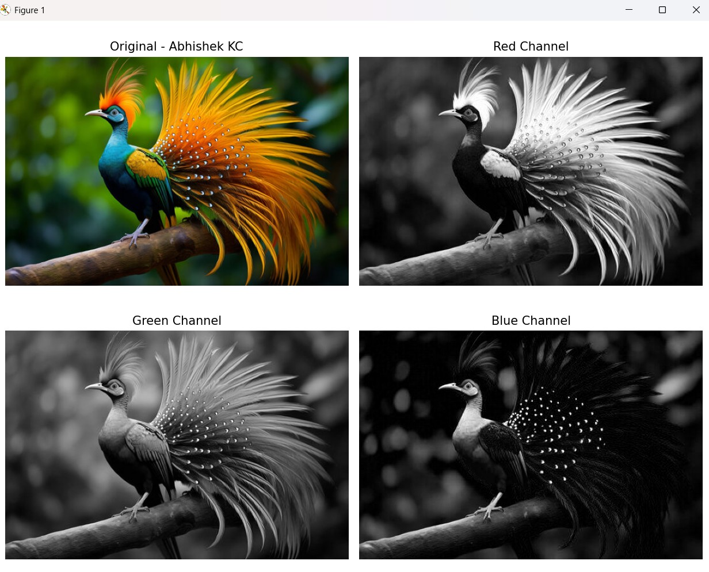
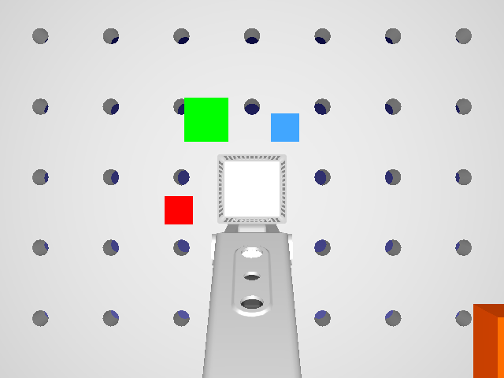
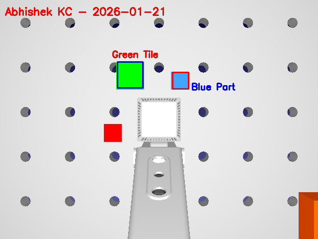

# Machine-Vision
Here is a Project showcase of all of the assignment of machine vision.

**Assignment: Introduction to MV tools** 
**Name: Abhishek KC** 
**Course: Machine Vision** 
**Tools: Python, OpenCV, RoboDk**

# Introduction: 
The purpose of this assignment was to become familiar with basic machine vision tools using Python, OpenCV, and RoboDK.

### 1. Task A – OpenCV Basics 
In Task A, a colorful image was loaded into Python using OpenCV. The image was first converted from the BGR color format (used by OpenCV) to the RGB format so that it could be displayed correctly using Matplotlib. After that, the three color channels (red, green, and blue) were separated.

---

<b>Original Image</b>

---

  

---

<b>RGB Image</b>

---

### 2. Task B – RoboDK Camera and Image Annotation 
In Task B1, a simulated 2D camera was added to a RoboDK station. A reference frame named CameraFrame was created and positioned above the worktable. The camera was attached to this frame and configured with a fixed resolution of 640×480 pixels. Several colored objects were placed on the table so that they were visible in the camera view.

In Task B2, a snapshot image from the RoboDK simulated camera was loaded into Python using OpenCV. The shape of the image (height, width, and number of channels) was printed to verify that the image was read correctly.

Two objects on the table were then selected and manually annotated. A rectangle was drawn around one object and another rectangle (or circle) around a second object using OpenCV drawing functions. Each object was labeled with a name.

Finally, the student’s name and the current date were written at the top of the image. The annotated image was saved and displayed.

# Conclusion
This assignment provided a clear introduction to machine vision tools using Python, OpenCV, and RoboDK. Basic image processing concepts were practiced, and the integration between simulation and vision was successfully demonstrated. The skills learned in this assignment form a strong basis for more advanced machine vision applications in future coursework.
